# Ramanujan Machine App[Version] Deployment and GitHub Actions Workflow Automation 

## 1. Introduction

### 1.1. Overview

Deploying new app versions to the BOINC platform is an involved process, which has been largely automated for existing apps, but still requiring a number of manual steps for new apps. It is important to not the following distinction. An "app" is a new algorithm with its own executable. An "app version" is an executable binary version of the code delivered to end users via the BOINC client. If you make a change to an algorithm to add behavior or to fix a bug, this will result in a new "app version". Creating "apps" ([outlined below](#121-creating-a-new-app)) has not been automated because it can be accomplished through the BOINC server admin web interface. Creating "app versions" has been automated and is the focus of this document and the newly defined GitHub Actions workflows.

### 1.2. Manual Steps

#### 1.2.1. Creating a new app

The app must exist in the BOINC server database before the GitHub Actions workflow can run successfully. This is accomplished by logging into the BOINC admin web app, and, from the landing page selecting "Manage applications" from the Computing column.

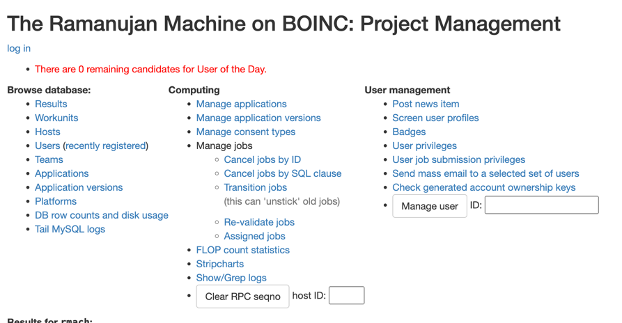

New apps can be created at the bottom of the subsequent page. It is important to select an app name and description that are appropriate for the public. The description should give end users enough information so that they know what the app is doing at a high level.

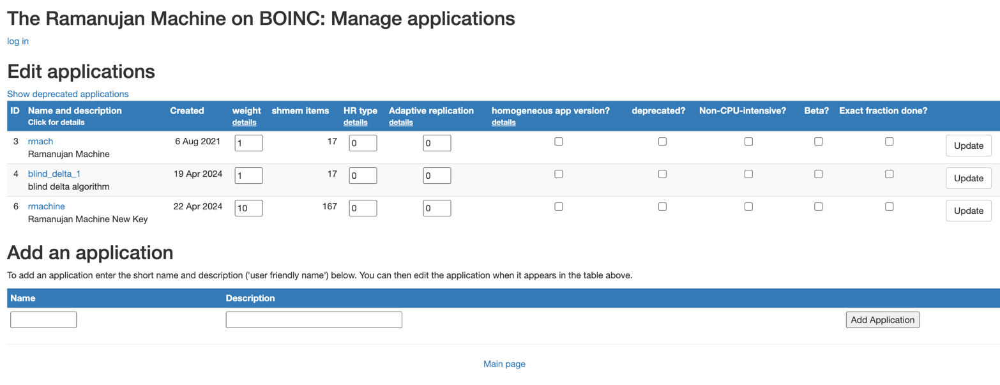

Note that checking the **Beta** column will only allow users registered as testers to run the app. 

You can redistribute the workload between apps using the **weight** value. There are links from the headings on this table to the appropriate BOINC documentation. While the documentation says that "if all weights are zero, results are interleaved uniformly", having some weights at zero and others nonzero will ignore the zero weighted apps, according to the [same documentation](https://boinc.berkeley.edu/trac/wiki/BackendPrograms). 

> Weight applications according to the value of their 'weight' field; if all weights are zero, results are interleaved uniformly. Without this option, runnable results are enumerated in an indeterminate order, and there may be periods when only results from one application are available for sending.

Any changes saved on this page will prompt that the changes will not take effect until the server is restarted. @TODO

After you create a new app, returning to the landing page, you can now select "Manage application versions". If you have just created a new app, then it will not yet show on this page until the code is deployed manually or by the GitHub Actions deployment.

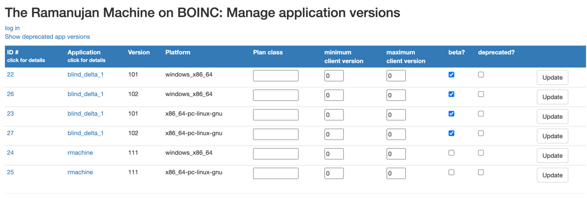

Here you can fine tune whether it is only specific versions of an app that are beta. You can also deprecate versions on this page.

There are two manual steps. 

#### 1.2.2. Setting up Daemons

Each new app requires its own set of daemons. This involves [modifying the config file](#5121-daemons) and should be done **after the first version is successfully deployed** via GitHub Actions.

#### 1.2.2. Setting up Templates

In the `/home/boincadm/projects/boinc/templates` folder on the BOINC server you will find boilerplate files named `appname_in` and `appname_out`, where `appname` is the "name" value of the new app you have created. These are currently copy/pastes for each app, but must be present for apps to be executed. They configure resource requirements and limits, as well as the location of the output, among many other things. Detailed documentation can be found [here](https://boinc.berkeley.edu/trac/wiki/JobTemplates).

## 2. Setting Up Secrets and Variables

Note: In order to deploy new code, whether for the first version of a new app just created, or for a new version of an existing app, the process requires SSH access to the BOINC server.

### 2.1. What are Secrets?

GitHub Action workflows are run on ephemeral servers. Credentials, such as SSH keys, can be stored as GitHub Actions Secrets and will be loaded into the workflow during execution. 

### 2.2. How to Add Secrets

#### Step-by-Step Instructions

In your GitHub repository, click on Settings on the top navbar.

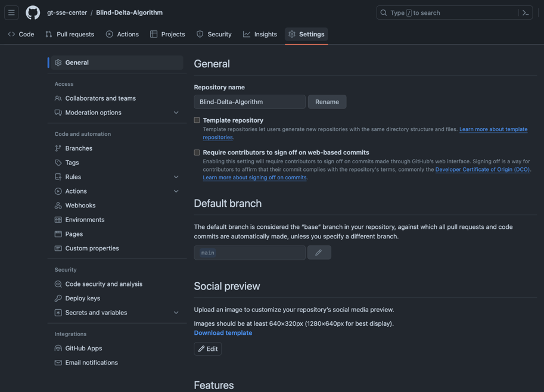

In the Security section of the sidebar, click on Secrets and variables > Actions.

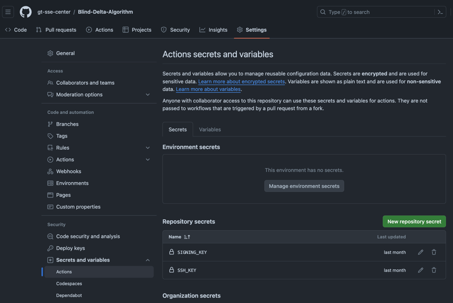

Click on New repository secret. 

Create a secret with `Name` `SIGNING_KEY` and another with `Name` `SSH_KEY`, entering the appropriate values for your BOINC server. These secrets will be necessary for the GitHub Actions to successfully complete. 

The `SIGNING_KEY` should be kept on secure media [off network](https://boinc.berkeley.edu/trac/wiki/CodeSigning). 

The `SSH_KEY` can be found in the home directory of the user you would like this process to use to SSH to the BOINC server. Ideally this user will be created on the BOINC server specifically for the purpose of executing this workflow and will not be used for anything else. 

### 2.3. Setting up Variables

There are additional values needed by the workflow, that do not need to be kept secret, but should be configured as GitHub Actions variables so that they are defined once and reused where needed to prevent typos and bugs. 

Select the `Variables` tab on the same page to configure the following variables.

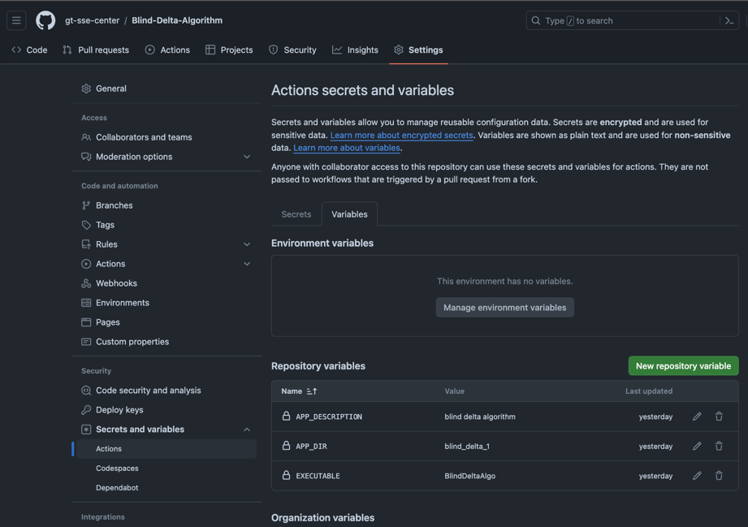

Define a variable named `EXECUTABLE` for the desired name for the cross-platform executable file created by `cx_Freeze`. This value is largely arbitrary as long as it complies with the file naming conventions for Windows, Linux and Mac.

Define a variable named `APP_DIR` and set it to the application "Name" that you gave to the application you created in the BOINC Admin user interface.

Define a variable named `APP_DESCRIPTION` and set it to the application "Description" you gave to the application you created in the BOINC Admin user interface.

## 3. Workflow Descriptions

### 3.1. Workflow build_and_deploy.yml

#### Trigger

[workflow_dispatch] (https://docs.github.com/en/actions/using-workflows/events-that-trigger-workflows#workflow_dispatch)

#### Purpose

This is the primary workflow. 

The first line of the workflow defines the "name" that is displayed on the left sidebar in the Actions tab overview page.

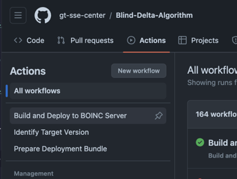

The `on` block that follows defines the trigger for this workflow. Refer to the GitHub documentation on what sorts of triggers are available, but if you can think of it, it probably exists!

In the case of this rather intensive workflow, we want to prevent multiple executions at once, especially since they may affect the stability of the BOINC server, and this is why we define a concurrency group at the top of the flow, and explicitly ask that any workflows running are aborted before starting another.

You can read more on concurrency in the [GitHub documentation](https://docs.github.com/en/actions/using-jobs/using-concurrency).

The `jobs` block follows. This is the substance of the automation and is outlined in more detail below.

#### 3.1.1. Job define-version

Because identifying the next app version for a BOINC app involves quite a few steps, it was bundled into its own workflow, invoked by this step. See [Section 2.2](#22-workflow-identify_target_versionyml) for details.

#### 3.1.2. Job generate-freeze-config

cx_Freeze requires a configuration file. This job generates that file based on the template configuration found in the `boinc` folder `freeze_config_template.py` file and your `EXECUTABLE` and `APP_DESCRIPTION` values.

#### 3.1.3. Job build-binaries

This job runs on a matrix. For further details you can refer to the [GitHub documentation](https://docs.github.com/en/actions/using-jobs/using-a-matrix-for-your-jobs). At a high level, this allows you to run the exact same series of steps across a set of inputs so that you do not have to specify similar steps multiple times. This particular job runs the cx_Freeze build on each of the three available GitHub runner platforms, Windows, Linux and Mac. The binaries are then uploaded as artifacts to GitHub.

#### 3.1.4. Job bundle-and-deploy

This job also runs on a matrix across all three major platforms. It proved complex enough to require its own workflow. See [Workflow bundle_app.yml](#23-workflow-bundle_appyml) for details.

#### 3.1.5. Job cleanup

In order to pass files between workflows and jobs, they have to be stored as GitHub artifacts. However, there is no reason to persist anything aside from the final binaries that get deployed on the BOINC server, so this step removes any other files generated during the course of workflow execution.

### 3.2. Workflow identify_target_version.yml

#### Trigger

[workflow_call] (https://docs.github.com/en/actions/using-workflows/events-that-trigger-workflows#workflow_call)

#### Purpose

This workflow identifies the last published version of the app and generates the next incremental version, defaulting to 1.0 for apps with no versions defined as yet.

#### Steps

The first step in this workflow is to identify the current version for the app. This is done by scraping https://rnma.xyz/boinc/apps.php using the `APP_DESCRIPTION` you set. If no match is found, the version default is `1.0`. 

BOINC only supports versions up to `x.99`, so the version script will increment the major version in this situation.

The next step is to define the appropriate version for the current build based on the web scraped content and the rules described above.

The version is stored as an artifact in GitHub Actions for use by later steps.

### 3.3. Workflow bundle_app.yml

#### Trigger

[workflow_call] (https://docs.github.com/en/actions/using-workflows/events-that-trigger-workflows#workflow_call)

#### Purpose

This workflow prepares the app bundle that will be deployed on the BOINC server. This includes the binary generated for a particular platform, the wrapper provided by BOINC for that platform, a job.xml file and a version.xml file. Signature files are also required for the binaries. This workflow runs in parallel to bundle artifacts for each of the major platforms: Windows, Mac and Linux.

#### Steps

The first step of this workflow is to download the appropriate wrapper for the platform passed in from the matrix. 

The `job.xml` is then generated from the `boinc/job_template.xml` file by substituting in the `EXECUTABLE` variable inside the file and by naming it with the generated new version and matrix-provided platform.

Then the `version.xml` is generated from the `boinc/version_template.xml` file substituting in the wrapper, version and platform values.

Since all apps have to have their own dedicated directories on the BOINC server and all app versions need to have distinct subdirectories under the app directory, a folder of the form `app.$NEW_VERSION-$PLATFORM` is then created and the previously cx_Freeze generated binary is downloaded from GitHub Actions artifacts and zipped inside of this folder.

The `job.xml` and the app zip file are both signed, with signatures stored into files of the same name as the signed file followed by the `.sig` extension, e.g. `job.$NEW_VERSION-$PLATFORM.xml.sig`.

The wrapper for the platform in question is then signed as well.

A zip file is generated containing all of these artifacts for the platform that is being processed. The zip file is then uploaded as an artifact. 

The SSH key from GitHub Secrets is used to establish a connection to the BOINC server. 

A new folder is created, if it does not exist, in the BOINC server apps folder, matching the path `/APP_NAME/NEW_VERSION`. The bundled artifact is copied to this location and unzipped. Finally, the BOINC provided `update_versions` script is invoked to pick up the new binaries.

A restart of services may be required at this point, but then the new app version should be visible in the 

## 4. Triggering GitHub Actions

### 4.1. How to Trigger a Manual Workflow

#### Step-by-Step Instructions

In the GitHub repository, click on Actions.

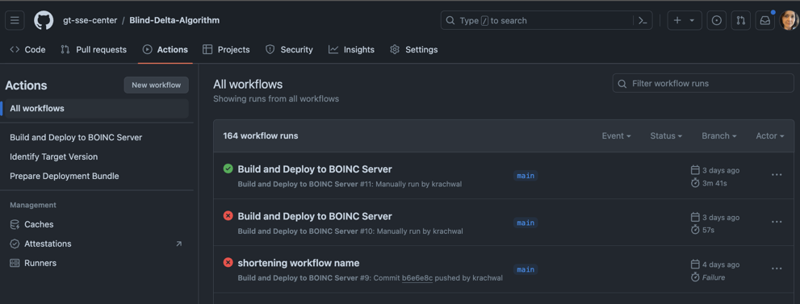

Find and click on the "Build and Deploy to BOINC Server" workflow on the left navbar.

Click on the Run workflow button on the upper right of the page.

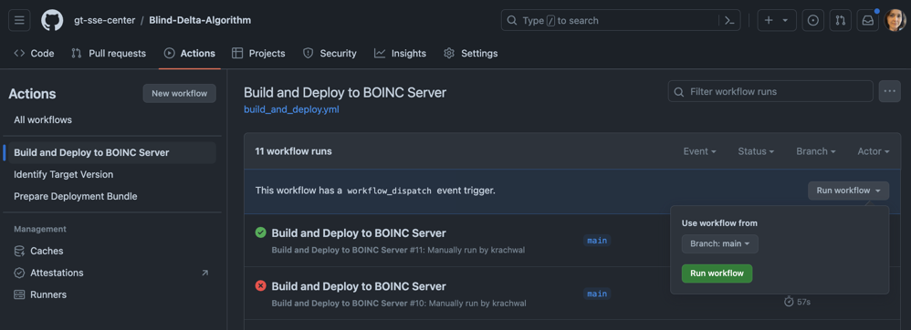

Select the branch you would like to deploy from (defaults to the primary branch) and click on the `Run workflow` button to start the workflow.

### 4.2. Monitoring Workflow Runs

Clicking on any of the previously executed workflows in the list will give you details of the run. This is particularly helpful if the icon to the left of the workflow is red and you need to diagnose the error. 

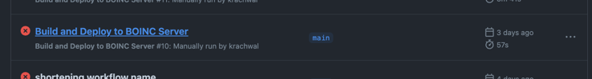

Clicking on the failed "run" displays the jobs for that workflow. You can click on the failed jobs to dig deeper.

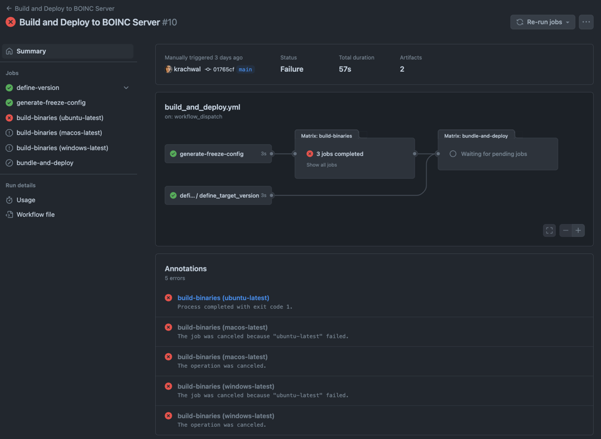

At the deepest level you should see the standard error output from the runner. 

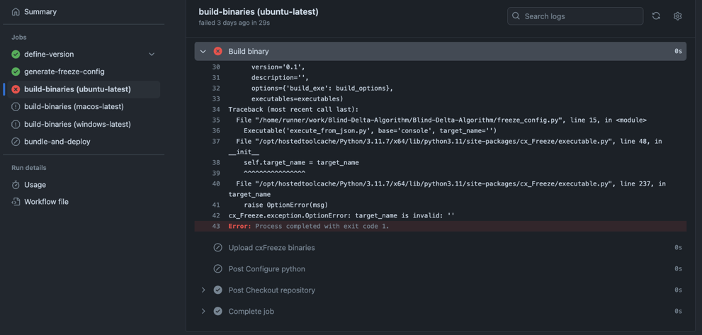

Clicking on a successful run will display a flowchart, indicating all of the "jobs" that were executed. Artifacts produced during the workflow will be displayed below the flowchart in a list, in this case the zipped subdirectories for the app version that was generated during the workflow execution. These artifacts can be unzipped in the appropriate app version folder if they fail to be copied to the BOINC server during the workflow execution.

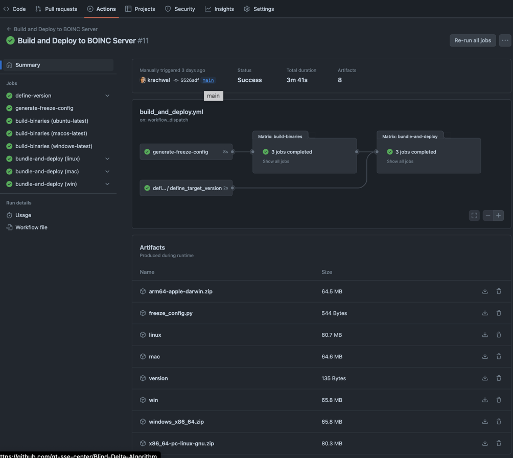

## 5. BOINC Internals

#### 5.1. The `boincadm` User

You must remember to `su boincadm` to run all BOINC scripts. You must also remember to `chown boincadm` and `chgrp boincadm` all files that are created or copied to the BOINC server.

#### 5.2. The `config.xml` File

Path: `/home/boincadm/projects/boinc/config.xml`

This file is loaded with default values when a new BOINC "project" is initially set up. A project comprises all apps and app versions. The file has its own extensive [documentation](https://boinc.berkeley.edu/trac/wiki/ProjectOptions).

There are many interesting settings in this file and available in the documentation and reviewing the list of options is advised since they control not only how clients interact with the BOINC server but also how the web application and the database are configured and the background daemon configurations. A [restart of services](#512-restarting-boinc-services) is required for changes to take effect.

##### 5.2.1. `daemons`

The most relevant portion of [`config.xml`](#512-the-configxml-file) is the daemon section, which was modified to add a new app and needs to be manually modified whenever a new app is created. This is because each app should have its own `validator` and `assimilator`. The most important thing to remember when configuring new validators and assimilators is that the `<output>` and `<pid_file>` **must be unique or they will silently fail to start**.

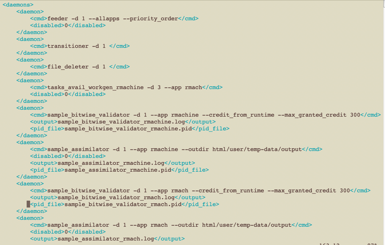

#### 5.3. The `project.xml` File

To make it possible for us to release Mac versions of apps, the project.xml file was modified as per the instructions found [here](https://boinc.berkeley.edu/trac/wiki/BoincPlatforms).

#### 5.4. Restarting BOINC Services

Switch to the `boincadm user`, navigate to the project, and stop and start services.

    $ su boincadm

    $ cd /home/boincadm/projects/boinc

    $ ./bin/stop

    $ ./bin/start

#### 5.5. The BOINC Feeder Service

The feeder runs as a daemon on the BOINC server. 

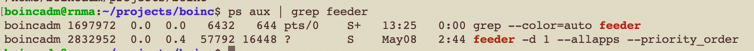

Some of the flags passed to this process were modified. We added the `--all-apps` parameter:

> Interleave work items from all applications. Weight applications according to the value of their 'weight' field; if all weights are zero, results are interleaved uniformly. Without this option, runnable results are enumerated in an indeterminate order, and there may be periods when only results from one application are available for sending.

We also added the `--priority_order` flag so that we could set a priority, because the weighted option did not seem to accomplish our desired goal.

The feeder parameters are configured in the [`config.xml`](#512-the-configxml-file) file in the `dameons` section:

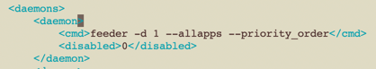

Services must be [restarted](#512-restarting-boinc-services) for changes to `config.xml` to take effect. All available feeder settings are documented [here](https://boinc.berkeley.edu/trac/wiki/BackendPrograms).

### 5.6. BOINC `apps` Directory

Path: `/home/boincadm/projects/boinc/apps`

All apps for the `boinc` project are found in the `apps` subdirectory. These directory names must correspond to the app `name` defined in the BOINC admin web interface. 

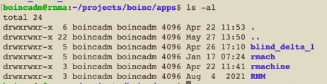

Each of these folders contains multiple app versions.

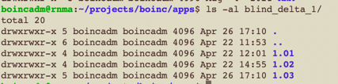

BOINC expects app versions to be numeric. They can either be digits or digits with dot dividers. If dots are used, only major and minor versions are to be provided. Minor versions are expected to go from 01 to no more than 99 before a new major version is defined. 

**It is important to note that the highest version number present for a specific platform is the version that will be executed by clients running on that platform.**

More details on defining app version can be found [here](https://boinc.berkeley.edu/trac/wiki/AppVersionNew).

### 5.7. App Version Directory Contents

Inside the [app version directory](https://boinc.berkeley.edu/trac/wiki/AppVersionNew), e.g. `/home/boincadm/projects/boinc/apps/blind_delta_1/1.03`, there is a directory for each BOINC defined platform ([see documentation for supported platforms](https://boinc.berkeley.edu/trac/wiki/BoincPlatforms)) for which the app version should be available. 

Within each of these platform folders, there are several required artifacts, describe in the sections below. 

#### 5.7.1. version.xml

This is the only file in an app version folder that does not require a signature file. 

    <version>
	    <file>
            <physical_name>wrapper_26002_x86_64-pc-linux-gnu</physical_name>
            <main_program/>
        </file>
        <file>
            <physical_name>job.1.03-linux.xml</physical_name>
            <logical_name>job.xml</logical_name>
        </file>
        <file>
            <physical_name>app.1.03-linux.zip</physical_name>
            <logical_name>app.zip</logical_name>
        </file>
        <is_wrapper/>
    </version>

The `physical_name` is the name of the wrapper file, which must be co-located in the app version folder. `main_program` indicates that this is the BOINC client's invocation target. This file also tells the client that the function of the `job.xml` file is being fulfilled by the file of "physical name" `job.1.03-linux.xml` and that the application binaries can be found in the `app.1.03-linux.zip` file. Because we are using the wrapper, the `<is_wrapper/>` tag is necessary.

More details can be found in the documentation [here](https://boinc.berkeley.edu/trac/wiki/WrapperApp).

#### 5.7.2. job.xml

This file must match the name that is specified as the `physical_name` for `logical_name` "job.xml" in the version.xml file. Following on the example from the previous section, this file would be named "job.1.03-linux.xml".

    <job_desc>
        <task>
            <!-- application should be the executable, i.e. includes .exe on Windows -->
            <application>BlindDeltaAlgo</application>
            <multi_process/>
            <!-- this command line works - do not change - magic -->
            <command_line>0001.json</command_line>
        </task>
        <unzip_input>
            <!-- this is a logical file name not a physical one - do not change -->
            <zipfilename>app.zip</zipfilename>
        </unzip_input>
    </job_desc>

The `application` "BlindDeltaAlgo" is the value that is [configured for GitHub Actions variable](#23-setting-up-variables) name `EXECUTABLE`.

The `unzip_input` block directs the client to unzip the `zipfilename` which is the `logical_name` for our binary bundle from the [`version.xml`](#571-versionxml) file.

This file requires a signature file of the same name with a `.sig` extension.

More details can be found in the documentation [here](https://boinc.berkeley.edu/trac/wiki/WrapperApp).

#### 5.7.3. app.zip

This zip file contains the output from the cx_Freeze command. The zipping command can be found in the `bundle_app.yml` file in the `.github/workflows` directory of this repo. 

    zip -r --junk-paths $BOINC_PLATFORM.zip . -i version.xml job.$NEW_VERSION-$PLATFORM.xml job.$NEW_VERSION-$PLATFORM.xml.sig $WRAPPER $WRAPPER.sig app.$NEW_VERSION-$PLATFORM.zip app.$NEW_VERSION-$PLATFORM.zip.sig

The zip file requires a signature file of the same name with a `.sig` extension.

#### 5.7.4. wrapper

Wrappers are provided by BOINC for each supported platform. They should be reviewed regularly for new versions and updated in the GitHub Actions `.yml` file. The download directory for these wrappers is [here](https://boinc.berkeley.edu/dl/).

This file requires a signature file of the same name with a `.sig` extension.

The wrapper is documented [here](https://boinc.berkeley.edu/trac/wiki/WrapperApp).

## 5.8. Code Signing

You must have the signing key to sign new binaries. 

**The signing key should be kept securely offline.**

You can use the BOINC provided `sign_executable` script for code signing manually (this is automated in GitHub Actions). It can be found in the `boinc` folder of this repository.

    .sign_executable job.$NEW_VERSION-$PLATFORM.xml signing_key_path > job.$NEW_VERSION-$PLATFORM.xml.sig
    .sign_executable app.$NEW_VERSION-$PLATFORM.zip signing_key_path > app.$NEW_VERSION-$PLATFORM.zip.sig
    .sign_executable $WRAPPER.exe signing_key_path > $WRAPPER.exe.sig
    .sign_executable $WRAPPER signing_key_path > $WRAPPER.sig

## 5.9. Making the New App Version Available

Once the [app is defined in the database](#121-creating-a-new-app), and all of the app version files are in place, there is still the need to get BOINC to recognize the new assets by running `./home/boincadm/projects/boinc/bin/update_versions` (this is automated in GitHub Actions).

## 6. Technologies Used

### 6.1. [cx_Freeze](https://cx-freeze.readthedocs.io/en/stable/)

The cx_Freeze utility requires a config file. The template is located in the `boinc` folder of this repository with the name `freeze_config_template.py` and has the following, largely boilerplate, contents:

    """
    This file is the template build configuration for cx_Freeze to generate an executable binary across platforms
    Parameters EXECUTABLE and APP_DESCRIPTION come from the GitHub workflow
    """
    from cx_Freeze import setup, Executable

    build_options = {'packages': [],
                 'excludes': ['tkinter'],
                 'build_exe': 'build/executable' # sets name of folder under build folder in which executables end up
                 }

    base = 'console'

    executables = [
        Executable('execute_from_json.py', base='console', target_name='{EXECUTABLE}')
    ]

    setup(name='{EXECUTABLE}',
        version='0.1',
        description='{APP_DESCRIPTION}',
        options={'build_exe': build_options},
        executables=executables)

You can choose to modify the entrypoint to something other than `execute_from_json.py`.  

You can also choose to modify the output directory to something other than `build/executable`, but the GitHub Actions workflow does expect this to be the location that is zipped and deployed on the BOINC server, so make sure to modify the path in the `build_and_deploy.yml` workflow as well under job `build-binaries`, step `Upload cxFreeze binaries`.

### 6.2. [GitHub Actions](https://docs.github.com/en/actions/using-workflows/workflow-syntax-for-github-actions)

GitHub Actions are well documented by GitHub and any relevant specifics have been called out throughout this document.

### 6.3. [MariaDB](https://mariadb.com/docs/server/ref/cs10.3/)

MariaDB is essentially a public domain fork of MySQL from some years ago that largely aligns with MySQL and is actively maintained. 

The `root` user has shell access to the MariaDB terminal. Simply issue the `mysql` command in the shell and you will be dropped into the database. 

From there you can enter `use boinc` to get dropped into the BOINC database.

All of the content visible in the web admin interface and quite a bit of extra detail not accessible from the UI can be found in the database.

You can display all tables by issuing the `show tables;` command.

The most interesting tables are:
- app
- app_version
- result
- workunit

The following query returns aggregated counts based on app version execution outcome other than the successful outcome:

    select outcome, app_version_num, app_version_id, appid, exit_status, count(*) 
    from result 
    where outcome<>1 
    group by outcome, app_version_num, app_version_id, appid, exit_status;

For reference, here are the enum values for a number of columns you may stumble upon:

`server_state:`
- 1 - inactive
- 2 - unsent
- 3 - unknown
- 4 - in progress
- 5 - over 

`outcome:`
- 0 - ---
- 1 - success
- 2 - couldn’t send
- 3 - computational error (really just error)
- 4 - no reply
- 5 - didn’t need
- 6 - validate error
- 7 - abandoned

`client state:`
- 0 - new
- 1 - downloading
- 2 - processing
- 3 - compute error
- 4 - uploading
- 5 - done
- 6 - aborted by user

`validate_state:` 
- 0 - initial 
- 1 - valid
- 2 - invalid
- 3 - work unit error check skipped
- 4 - checked but no consensus yet
- 5 - task reported too late to validate

The following query may help in isolating which exit statuses are the most common.

    select exit_status, count(*) 
    from result 
    where outcome <> 1 group by exit_status;

Here is some sample output (outdated!) with notes:

    +-------------+----------+
    | exit_status | count(*) |
    +-------------+----------+
    | -1073741819 |       11 | <-- various wrapper and Win errors
    | -1073741502 |        1 | <-- failed to init - couldn't start app: CreateProcess() failed
    |        -187 |        2 | -- -187 (0xFFFFFF45) ERR_RESULT_UPLOAD e.g. output file missing or invalid
    |        -186 |        2 | -- -186 (0xFFFFFF46) ERR_RESULT_DOWNLOAD e.g. WU download error: couldn't get input files: -224 (permanent HTTP error)
    |        -185 |       14 | -- -185 (0xFFFFFF47) ERR_RESULT_START e.g. couldn't start app: Task file app.1.06.zip: file missing
    |        -112 |        2 | -112 (0xFFFFFF90) ERR_XML_PARSE might be that file is open? (unknown error) (317) - exit code 4294967184 (0xffffff90)
    |           0 |     4739 | -- THIS IS A BIG BUCKET but outcome here is 5 "didn't need" (3 for all other rows) - i.e. IGNORE these 
    |           1 |      295 | -- operation not permitted? - "Incorrect function. (0x1) - exit code 1 (0x1)"
    |         127 |        1 | -- ../../projects/rnma.xyz_boinc/wrapper_26014_x86_64-pc-linux-gnu: error while loading shared libraries: ./libgcc_s.so.1: file too short
    |         193 |        1 | only one is a segfault
    |         194 |       43 |
    |         195 |      911 |
    |         197 |      191 |
    |         200 |     4706 |
    |         202 |      405 |
    |         203 |     1864 |
    |         255 |        3 | -- The extended attributes are inconsistent. (0xff) - exit code 255
    +-------------+----------+

It might be helpful to also run this query with the app version, e.g.:

    select app_version_id, exit_status, count(*) 
    from result 
    where outcome = 3 
    group by exit_status 
    order by app_version_id, exit_status;

**The error codes are not documented.** The best place to figure out what they are is [in the code itself](https://github.com/BOINC/boinc/blob/07076857b3e4301c671cbc6d0616796c7122e92f/lib/error_numbers.h). 

## 7. Troubleshooting and Relevant Documentation

**BOINC documentation** can be find both on their [web page](https://boinc.berkeley.edu/trac/wiki/SoftwareDevelopment) and their [GitHub repository wiki](https://github.com/BOINC/boinc/wiki). The latter does not provide a table of contents. It does happen that documentation in one place is contradicted by documentation in the other, so it is advisable that anything found therein is tested before being assumed to be true. This is likely due to the 20 year history of the project and outdated documentation still being present on some topics. Due to the lack of Table of Contents or Index, performing a site search (in the Google search box or the Chrome address bar) is the easiest way to find relevant docs, e.g. looking for documentation on "debugging" would look like this: 

    site: https://github.com/BOINC/boinc/wiki debugging

You can also query the repository directly using the search bar in GitHub, if the documentation search does not return any hits.

There is a somewhat useful, although slow, BOINC Web page that lists the most common errors and the associated results. It can be found [here](https://rnma.xyz/1b50635216bc11eca7a35f5cf61fb0ec/error_summary.php?nresults_per_code=5&ncodes=20). You can adjust how many `results_per_code` and how many total error types (or `ncodes`) by modifying the query string directly.

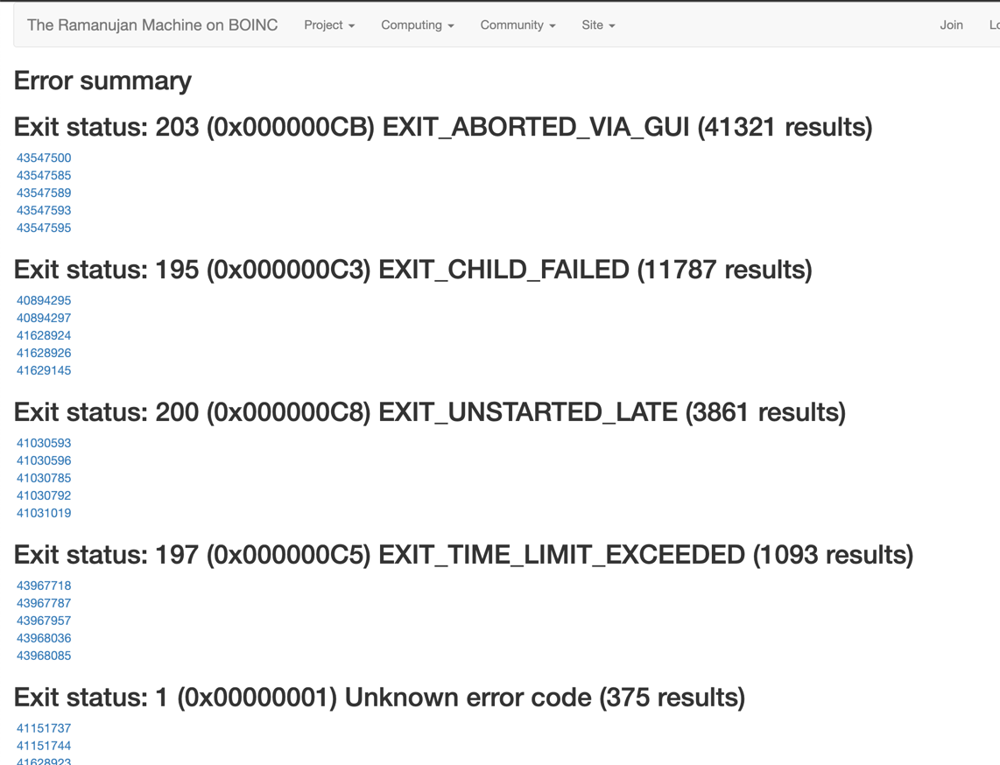

clicking on one of the results presents you with details such as this:

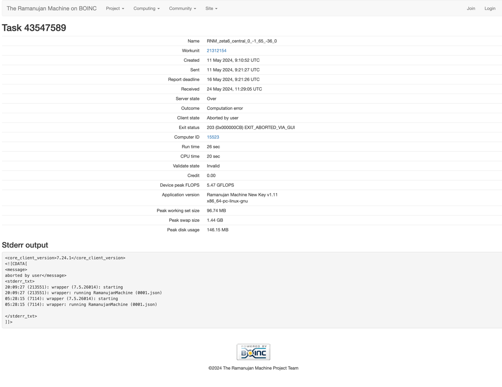